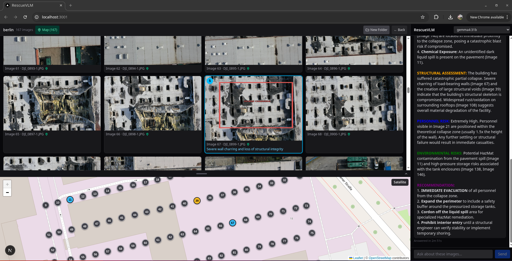

<h1 align="center">RescueVLM</h1>
 

  <b>Open-source, training-free, model-agnostic triage for UAV search-and-rescue imagery — fully on-premise, with no cloud dependency and no fine-tuned weights.</b>

  

---
 
After a flood, a wildfire, or a building collapse, drones are often the first source of reliable overview imagery. But a single survey flight can produce hundreds of photos — and the people who need answers rarely have the time, the compute, or the connectivity to sift through them on scene.
 
**RescueVLM** points a locally running vision-language model (VLM) at a folder of UAV survey images. Incident commanders simply ask a question in natural language — *"Are there people in danger?"*, *"Do any buildings look unstable?"*, *"Are there further fire hotspots?"* — and RescueVLM surfaces the most relevant images, marks critical areas, and explains its assessment in plain language. In the field setup this takes roughly 30 seconds, and the complete image set always remains available for human review.
 
## Why RescueVLM
 
- **Disaster areas are offline.** Power, internet, and mobile networks are exactly what large-scale emergencies tend to destroy — so cloud-based AI services are not an option on scene. RescueVLM runs entirely on local hardware.
- **Sensitive imagery stays on site.** Pictures of victims and damaged property never leave the device.
- **Manual review doesn't scale.** Triaging hundreds of frames by hand is slow and fatiguing, right at the moment when minutes matter most.
## Key properties
 
- **Training-free** — no dataset collection, no fine-tuning, no training pipeline. Search-and-rescue expertise is encoded in carefully engineered prompt instructions rather than baked into model weights, so RescueVLM works out of the box with off-the-shelf VLMs.
- **Model-agnostic** — not tied to any single model. Swap in whichever VLM fits your hardware, including future models, without touching the pipeline. This keeps the tool useful as the fast-moving VLM landscape evolves.
- **Fully on-premise** — no cloud dependency, no internet required, suitable for connectivity-denied disaster areas.
- **Human-in-the-loop by design** — RescueVLM is a decision-support tool, not a replacement for human judgment. It prioritizes and explains; the incident command decides, and nothing is hidden or discarded.
- **Open source** — free to use, audit, and adapt for civil-protection organizations and researchers.
## How it works
 
1. **Ingest** — point RescueVLM at a directory of UAV survey images.
2. **Ask** — responders formulate a mission question in natural language.
3. **Triage** — RescueVLM queries the configured vision-language model about the imagery using its built-in domain prompts.
4. **Review** — the most relevant frames are surfaced first, critical regions are highlighted, and every rating comes with a human-readable explanation. The full dataset remains accessible throughout.
 
## Built for the field: the solar-powered AI ground station
 
RescueVLM is the heart of a mobile, solar-powered ground station developed in the robotics lab of [Westfälische Hochschule](https://www.w-hs.de/) (Westphalian University of Applied Sciences) in Gelsenkirchen, Germany, led by Prof. Dr.-Ing. Hartmut Surmann. Built from a modified off-the-shelf stroller chassis, a gaming laptop, a battery, and a solar panel, the station generates its own power, sets up its own local Wi-Fi, and provides capable on-site compute for AI-based drone image analysis.
 
A motorized wheel, combined with GPS, compass, and sensor data, automatically turns the solar panel toward the sun — yielding around 40&nbsp;% more energy than a fixed panel — while the folding chassis fits into a car and its suspended wheels handle rough terrain.
 
The robotics lab researches autonomous systems, rescue robotics, and machine learning, is a founding member of the German Rescue Robotics Center (DRZ) in Dortmund, and has field-tested its ground and aerial robots in real disaster deployments.
 
## Press coverage
 
- Westfälische Hochschule, Aug 17, 2026: [Vom Kinderwagen zur mobilen Katastrophenhilfe: KI-Station unterstützt Einsatzkräfte](https://www.w-hs.de/pressemedien/nachrichten-lesen/news/detail/News/vom-kinderwagen-zur-mobilen-katastrophenhilfe-ki-station-unterstuetzt-einsatzkraefte/)
- WAZ: [Mit dem Kinderwagen ins Krisengebiet: Gelsenkirchener Studenten bauen KI-Station](https://www.waz.de/lokales/gelsenkirchen/article412894638/mit-dem-kinderwagen-ins-krisengebiet-gelsenkirchener-studenten-bauen-ki-station.html)
 
